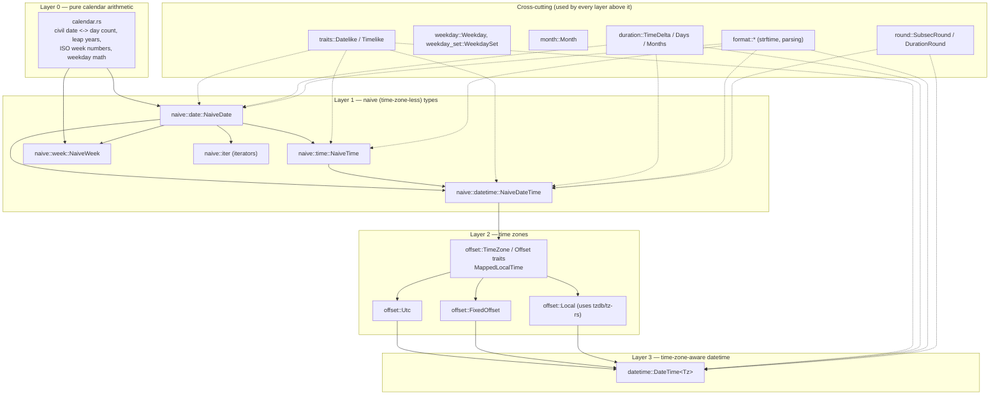
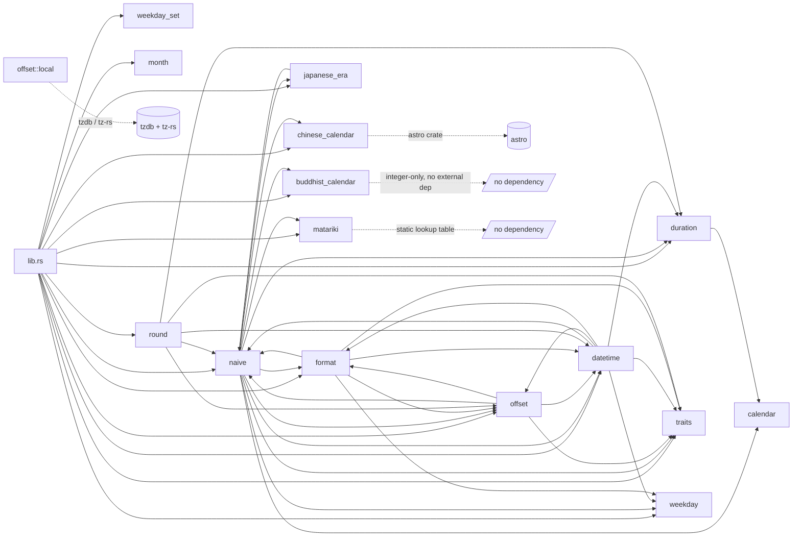
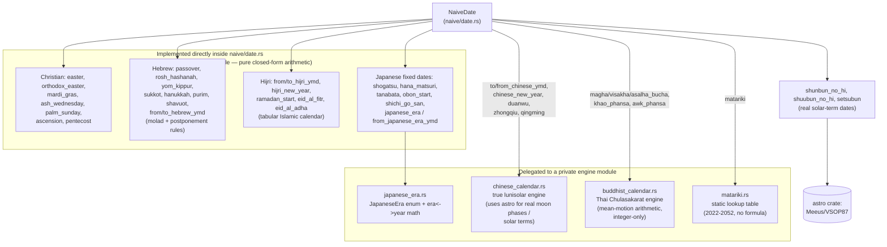
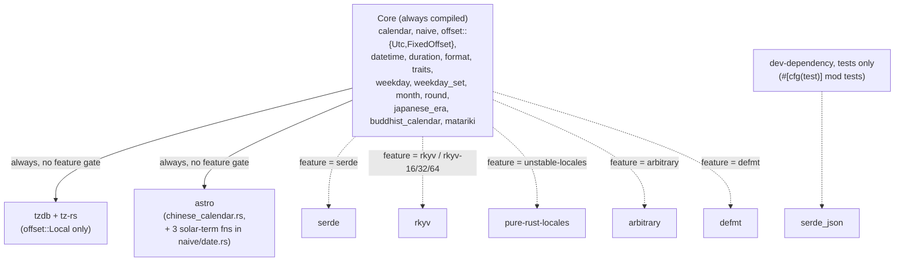
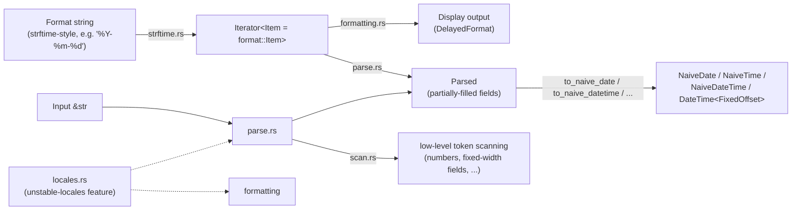

# `time_compute` Architecture

This document describes the internal architecture of `time_compute`: how the
crate is organized, how its modules depend on one another, and the design
conventions that hold the codebase together. It is aimed at anyone who needs
to read, extend, or maintain the source — including future contributors who
were not part of the original design conversations.

For the public-facing feature list, see the crate's top-level documentation
(`src/lib.rs`). For what each `time_compute`-only extension computes and
how to call it, see `docs/API_Reference.md` (Part 2) and
`docs/Use_Example.md`. This document is about *how the code is put
together*, not what each function computes.

---

## 1. Goals and constraints that shaped the design

Three constraints drive almost every architectural decision in this crate:

1. **API parity with `chrono`.** Every public type, method, and trait is
   meant to be a drop-in replacement for its `chrono` counterpart: same
   name, same signature, same behavior. A project depending on `chrono`
   should be able to migrate by changing `use chrono::...` to
   `use time_compute::...` and nothing else. This means the module layout
   deliberately mirrors chrono's own (`naive`, `offset`, `format`, `round`),
   even where a different internal layout might otherwise be simpler.

2. **Near-zero dependencies for the core.** Calendar math, durations, and
   the naive (time-zone-less) types have **no external dependency at all**.
   A small, explicit, and documented set of exceptions exists for
   functionality that cannot reasonably be reimplemented from scratch (time
   zone databases, real astronomical positions) or that is opt-in via a
   Cargo feature (serialization, locales, fuzzing, embedded logging). See
   [§6](#6-dependencies-and-feature-flags).

3. **A frozen "chrono-compatible core" plus a clearly marked "extension"
   layer.** Anything with a chrono equivalent must behave identically to
   chrono. Anything without a chrono equivalent (Hebrew/Hijri/Chinese/
   Japanese/Thai calendars, Matariki, `age()`, ...) is still held to the
   same quality bar (tests, docs, `#[must_use]`, `const fn` where possible)
   but is explicitly labeled in both the doc comments and the source
   comments with the marker:

   ```rust
   // time_compute extension -- not part of chrono
   ```

   This lets a reader (or an automated tool) immediately tell which surface
   is a compatibility guarantee and which is free to evolve.

---

## 2. Directory and file layout

```text
Time-Compute/
├── Cargo.toml                 Crate manifest: dependencies, feature flags
├── Cargo.lock
├── LICENSE
├── docs/
│   ├── Architecture.md        This document
│   ├── API_Reference.md       Exhaustive function-by-function reference
│   ├── About_dependencies.md  Why each dependency exists, and its exact scope
│   ├── About_testing.md       Testing methodology and unit-test breakdown
│   ├── Use_Example.md         Runnable usage examples, core + extensions
│   └── About_time_compute.md  Project philosophy: why the crate exists
└── src/
    ├── lib.rs                 Crate root: module tree, public re-exports
    ├── calendar.rs            (private) Gregorian civil-date <-> day-count math
    ├── traits.rs              Datelike / Timelike (component-access traits)
    ├── weekday.rs             Weekday enum
    ├── weekday_set.rs         WeekdaySet (packed set of Weekday)
    ├── month.rs                Month enum
    ├── duration.rs             TimeDelta / Duration, Days, Months
    ├── round.rs                SubsecRound / DurationRound
    ├── datetime.rs             DateTime<Tz> (date + time + time zone)
    ├── japanese_era.rs         JapaneseEra enum                      [ext]
    ├── chinese_calendar.rs     Chinese lunisolar engine (private)     [ext]
    ├── buddhist_calendar.rs    Thai/Buddhist lunisolar engine (priv.) [ext]
    ├── matariki.rs             Matariki lookup table (private)        [ext]
    ├── naive/
    │   ├── mod.rs              Re-exports for the `naive` module
    │   ├── date.rs              NaiveDate (+ most calendar extensions live here)
    │   ├── time.rs              NaiveTime
    │   ├── datetime.rs          NaiveDateTime
    │   ├── week.rs              NaiveWeek
    │   └── iter.rs               Day/week iterators over NaiveDate
    ├── offset/
    │   ├── mod.rs               TimeZone / Offset traits, MappedLocalTime
    │   ├── utc.rs                Utc
    │   ├── fixed.rs               FixedOffset
    │   └── local.rs                Local (the only module using tzdb/tz-rs)
    └── format/
        ├── mod.rs                Shared formatting/parsing types (Item, Fixed, ...)
        ├── strftime.rs            strftime-style format string -> Item iterator
        ├── formatting.rs           Item iterator -> Display output
        ├── parse.rs                 Item iterator + &str -> Parsed
        ├── parsed.rs                Parsed (partially-filled date/time fields)
        ├── scan.rs                   Low-level string-scanning helpers
        └── locales.rs                 Locale data (unstable-locales feature)
```

`[ext]` marks modules that exist purely to back `time_compute`-only
functionality with no chrono equivalent.

Two files at the repository root are worth calling out because they are easy
to mistake for source: `chinese_calendar_debug.txt` and
`differential_report.json` are throwaway artifacts from earlier debugging /
test runs, not part of the crate.

---

## 3. Layered architecture

The crate is best understood as four layers, each built strictly on top of
the previous one. Higher layers depend downward only; nothing in a lower
layer ever depends on a higher one.



**Why this shape:** `calendar.rs` is the only place that knows how to convert
a `(year, month, day)` triple into a signed day count and back. Every date
type builds on that single source of truth, so a bug fix or a precision
change there (e.g. the accepted year range) propagates everywhere
automatically instead of needing to be duplicated. `NaiveDate`/`NaiveTime`/
`NaiveDateTime` know nothing about time zones; `offset` adds the concept of
"an offset from UTC" as a trait (`TimeZone`) with three implementations
(`Utc`, `FixedOffset`, `Local`); `DateTime<Tz>` is generic over any
`TimeZone` implementation and is simply a `(NaiveDateTime, Tz::Offset)` pair
plus the arithmetic/formatting/comparison methods layered on top.

---

## 4. Module dependency graph (as written in the `use` statements)

The diagram below reflects actual `use crate::...` edges between modules
(not the conceptual layering above, but the literal Rust module graph).



There is an apparent cycle between `naive` and `offset` and between `naive`
and `datetime` (`naive::datetime` needs `offset::TimeZone`/`FixedOffset` to
implement `and_utc`/`and_local_timezone`, while `offset` needs
`naive::{NaiveDate, NaiveDateTime}` to define what a time zone converts
to/from). This isn't a real cyclic *crate* dependency — it's normal
intra-crate coupling that the Rust compiler resolves freely because
everything lives in one compilation unit. It does mean these modules must be
read together to fully understand either one in isolation.

---

## 5. The extension layer: how non-chrono calendars plug in

Every calendar/festival system without a chrono equivalent follows the same
plug-in pattern: a private engine module holds the algorithm, and
`naive/date.rs` exposes a thin set of public, documented, usually `const fn`
wrapper methods on `NaiveDate`.



Four distinct implementation *strategies* are used, and picking the right
one per calendar was itself a design decision:

| Calendar / system | Strategy | Why |
|---|---|---|
| Christian (Easter family) | Closed-form congruence (Meeus/Jones-Butcher-ish), inline in `naive/date.rs` | A single formula computes the date directly; no state to carry between years. |
| Hebrew | *Molad* + postponement rules, inline, integer-only, anchored to one verified real date | Lunisolar but governed by fixed arithmetic rules (19-year Metonic cycle) — no true astronomy needed. |
| Hijri | Tabular (arithmetic) Islamic calendar, inline | By design a fixed 30-year leap-year cycle; deliberately not the *observational* calendar used for religious practice in some countries, which cannot be computed at all. |
| Japanese solar terms | Real astronomical computation via `astro` | Solar terms are defined by the Sun's actual ecliptic longitude; a formula-only approximation would drift and periodically give the wrong day. This is the crate's only floating-point, non-`const fn` code. |
| Chinese lunisolar | Real astronomical computation via `astro`, plus a `thread_local!` memoization cache (`chinese_calendar.rs`) | Same reasoning as Japanese solar terms (new moons and zhongqi are astronomical events), but with heavier repeated computation per query, hence the cache. |
| Thai/Buddhist lunisolar | Pure integer mean-motion arithmetic, own module | A centuries-old traditional reckoning defined by mean rates, not real positions — reproducing it faithfully means matching the *traditional* arithmetic, not the sky. |
| Matariki | Static lookup table, own module | Not computable at all: the date is decided by a New Zealand government committee and published, not derived from a rule. Returns `None` outside the published 2022-2052 range rather than guessing. |

---

## 6. Dependencies and feature flags



Solid arrows are unconditional dependencies (compiled in even with no
features enabled); dashed arrows are opt-in via a Cargo feature, each named
to match chrono's own feature of the same purpose 1:1. `tzdb`/`tz-rs` and
`astro` are the only two unconditional dependencies, and both are narrowly
scoped: `tzdb`/`tz-rs` only inside `offset/local.rs` (reading the IANA time
zone database / detecting the system zone), `astro` only inside
`chinese_calendar.rs` and three solar-term functions in `naive/date.rs`
(real lunar/solar position calculations). Every other module — the
Gregorian calendar core, `NaiveDate`/`NaiveTime`/`NaiveDateTime`, `Utc`,
`FixedOffset`, durations, formatting, the Hebrew/Hijri/Christian
calendars, the Thai/Buddhist calendar, and Matariki — has zero dependencies,
external or otherwise.

`serde_json` appears only as a `dev-dependency`, used exclusively by this
crate's own `#[cfg(test)] mod tests` blocks (the `serde_round_trip`-style
tests gated behind the `serde` feature) to check that a value survives a
JSON round trip. See `docs/About_dependencies.md` for the full,
per-dependency breakdown, and `docs/About_testing.md` for the testing
methodology.

---

## 7. Testing

Correctness is checked by **492 unit tests** (`#[cfg(test)] mod tests` in
every source file), each validated against external ground truth: published
festival tables, astronomical references, independent reference
implementations, wide-range round-trip properties, and cross-date
invariants. See `docs/About_testing.md` for the full methodology and a
per-file breakdown.

An earlier, dev-only diagnostic tool (`examples/differential_check.rs`)
additionally cross-checked the chrono-compatible surface against the real
`chrono` crate during development; it has since been removed, along with
`chrono` as a dev-dependency, once it had served its purpose. `chrono` is
not, and has never been, a dependency of the published `time_compute`
library in any configuration — see `docs/About_dependencies.md`.

---

## 8. Formatting/parsing subsystem

`format/` is the largest single subsystem after `naive/date.rs`. It is built
around one shared, iterator-based intermediate representation:



Both formatting and parsing consume/produce the same `Item` sequence, so the
specifier table (documented in full in `strftime.rs`'s module doc comment)
only has to be defined once and is guaranteed to behave consistently in
both directions. `Parsed` is the single point where partially-collected
fields (year, month, weekday, hour, ...) are cross-checked for consistency
and resolved into a concrete value — this is also the type public callers
can use directly to build custom parsers.

---

## 9. Coding conventions worth knowing before editing

- **`#[must_use]` on every non-mutating, non-trivial method** that returns a
  new value rather than modifying `self`.
- **`const fn` wherever the algorithm allows it** (almost everything except
  `astro`-backed solar/lunar functions, which need floating point). This is
  a deliberate choice, not automatic — it lets consumers use these
  functions in `const` contexts, and signals which functions are "pure
  arithmetic" versus "delegates to a real astronomical library."
- **Fallible constructors return `Option`, never panic**, except for a
  small set of deprecated `chrono`-parity methods explicitly kept as
  panicking for API compatibility (each marked `#[deprecated(note = "use
  ..._opt() instead")]`).
- **Every module and public item has a doc comment**, and every
  `time_compute`-only item additionally carries a `# \`time_compute\`
  extension -- not part of chrono` section explaining why it exists and
  (for anything non-trivial) how it was verified.
- **Engine modules are `pub(crate)` or fully private**; the public surface
  lives on the naive/datetime types themselves (thin wrapper methods), not
  on the engine module directly. `chinese_calendar.rs`, `buddhist_calendar.rs`,
  `matariki.rs`, and `japanese_era.rs`'s internals all follow this rule —
  only `JapaneseEra` itself (the enum) is publicly re-exported from
  `lib.rs`, not any function from the other three modules.
- **`#[cfg(test)] mod tests` at the bottom of the same file** being tested,
  using `use super::*;` — no separate `tests/` integration-test tree; every
  one of the 492 unit tests lives next to the code it checks.
- **`#![forbid(unsafe_code)]`** at the crate root (`lib.rs` line 50): no
  `unsafe` anywhere in the crate, no exceptions.
